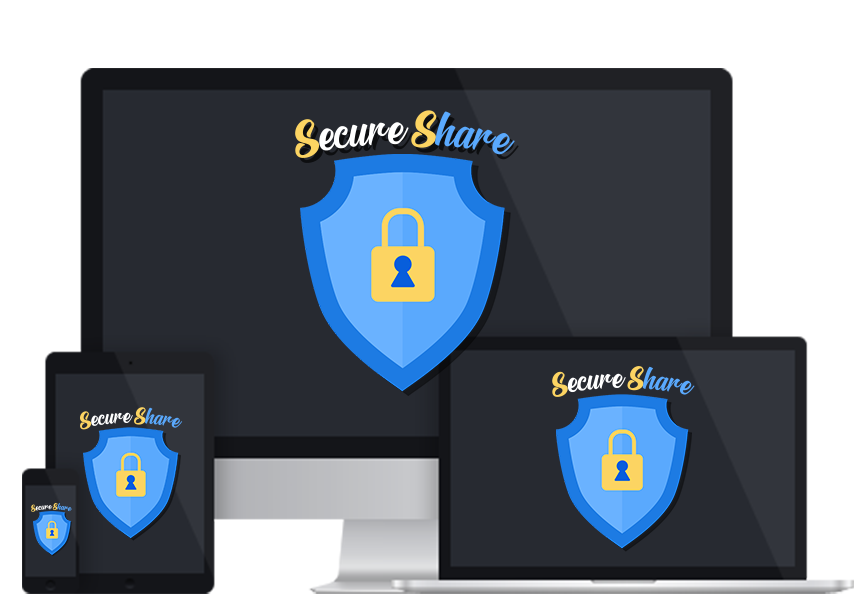

SecureShare is a decentralized, secure file-sharing application designed to ensure privacy and complete control over shared data. The project focuses on end-to-end encryption, ensuring data is encrypted both during transmission and storage, allowing secure access only to authorized users. Developed as my high school final project, SecureShare was created primarily through self-learning to address the growing need for file-sharing solutions that protect user privacy. It offers a simple and intuitive user experience along with high-level data protection.
